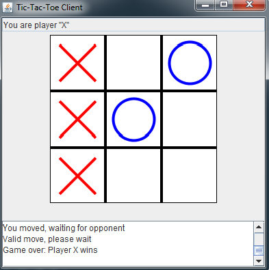
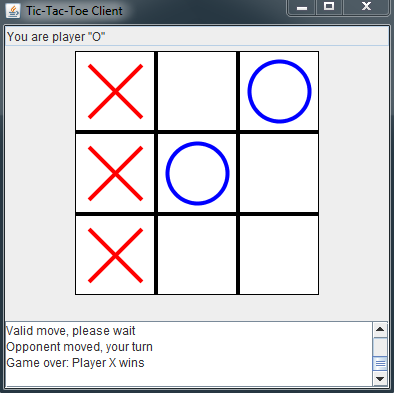
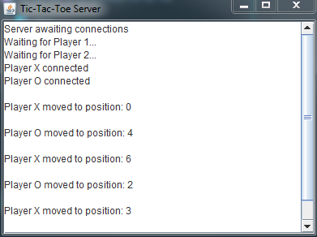

# ✨ Tic Tac Toe Game in Java ✨

[](https://opensource.org/licenses/MIT)
[](https://www.java.com)
[](https://github.com/Surendra1341/TicTacToe_Java)

## 🎮 Overview

This is a fully-featured Tic Tac Toe implementation built in Java, offering both local play and client-server multiplayer functionality. The game features a clean UI, intuitive controls, and networking capabilities for remote play.


## ✨ Features

- 🏠 **Local Play Mode**: Play against a friend on the same computer
- 🌐 **Client-Server Mode**: Play over a network connection
- 🎨 **Intuitive User Interface**: Clean and responsive design
- 🔄 **Real-Time Updates**: Instant game state synchronization
- 🏆 **Win Detection**: Automatic detection of winning conditions
- 🔁 **Play Again**: Easy restart for multiple games

## 📷 Screenshots

### First Player View
<p align="center">

</p>

### Second Player View
<p align="center">

</p>

### Server Display
<p align="center">

</p>

## 🚀 Getting Started

### Prerequisites

- Java JDK 8 or higher
- Git (for cloning the repository)

### Installation

1. Clone the repository:
   ```bash
   git clone https://github.com/Surendra1341/TicTacToe_Java.git
   ```

2. Navigate to the project directory:
   ```bash
   cd TicTacToe_Java
   ```

3. Compile the Java files:
   ```bash
   javac -d bin src/*.java
   ```

## 🎯 How to Play

### Local Mode

1. Start the game in local mode:
   ```bash
   java -cp bin TicTacToeLocal
   ```

2. The first player will be X and the second player will be O.
3. Players take turns clicking on the grid to place their mark.
4. The game announces the winner or a draw when the game ends.

### Network Mode

1. Start the server:
   ```bash
   java -cp bin TicTacToeServer
   ```

2. Start the client applications (on separate computers if playing remotely):
   ```bash
   java -cp bin TicTacToeClient
   ```

3. Enter the server's IP address when prompted.
4. Play begins when two players have connected.

## 🏗️ Project Structure

```
TicTacToe_Java/
├── src/                     # Source code files
│   ├── Board.java           # Game board logic
│   ├── GameLogic.java       # Core game rules
│   ├── LocalGame.java       # Local play implementation
│   ├── TicTacToeClient.java # Client implementation
│   ├── TicTacToeServer.java # Server implementation
│   └── GUI/                 # User interface components
├── resources/               # Images and resources
│   ├── firstPlayer.png
│   ├── secondPlayer.png
│   └── serverDisplay.png
├── bin/                     # Compiled class files
└── README.md                # Project documentation
```

## 🛠️ Technical Implementation

- **Java Swing**: Used for the graphical user interface
- **Socket Programming**: Enables network communication
- **Multi-threading**: Handles concurrent client connections
- **MVC Pattern**: Separates game logic from presentation

## 🤝 Contributing

Contributions are welcome! Feel free to fork the repository and submit pull requests.

1. Fork the Project
2. Create your Feature Branch (`git checkout -b feature/AmazingFeature`)
3. Commit your Changes (`git commit -m 'Add some AmazingFeature'`)
4. Push to the Branch (`git push origin feature/AmazingFeature`)
5. Open a Pull Request

## 📜 License

This project is licensed under the MIT License - see the LICENSE file for details.

## 👤 Author

**Surendra**

- GitHub: [Surendra1341](https://github.com/Surendra1341)

## 🙏 Acknowledgments

- Thanks to all contributors who have helped with the project
- Inspired by classic Tic Tac Toe gameplay
- Special thanks to the Java community for their resources and support

---

⭐ Star this repository if you find it useful! ⭐
